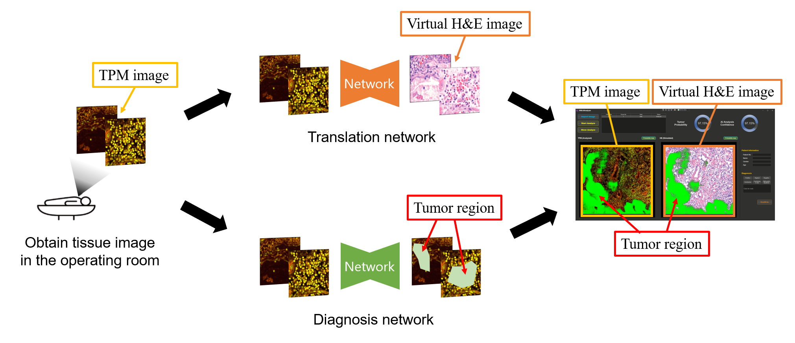
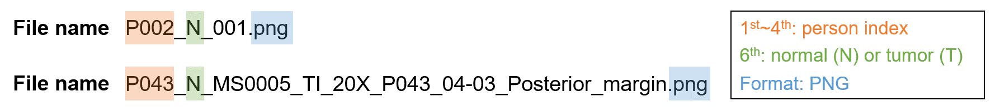
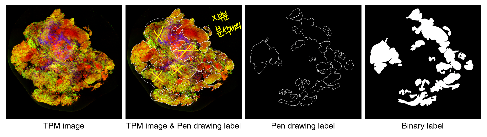
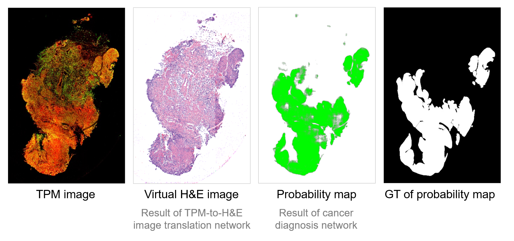

# KMDF Cancer Diagnosis

*Last update: 01/04/2024* <br/>
\* Previous version is here: https://github.com/NICALab/KMDF_diagnosis <br/>
\* All codes related to KMDF projects (diagnosis, image translation), corresponding explanation files and dataset are here: \143.248.159.179\Lab_share\01_data\Minyoung

## KMDF project
<p align="center">

</p>

This project consists of two parts:
1) KMDF cancer diagnosis
2) KMDF image translation

The purpose of this project is to develop software that performs cancer diagnosis and conducts TPM-to-H&E image translation from the patient's TPM image. Our role is to develop an AI model for cancer diagnosis and image translation. <br/>
** TPM image: Two-Photon Microscopic image<br/>
** H&E image: Hematoxylin and eosin stained image

## Goal of the cancer diagnosis
The goal is to create a probability map that outputs the probability of cancer at the pixel level from the input TPM image.

## Network architecture
<p align="center">

</p>

UNet architecture with MobileNetV2 in the encoder is used. <br/>
Reference: https://github.com/qubvel/segmentation_models.pytorch

## Dataset
You can find the dataset in NAS. <br/>
1) The data received from IVIM without any preprocessing: \\143.248.159.111\Lab_share\01_data\KMDF_TPM_HE
2) The dataset after preprocessing: \\143.248.159.179\Lab_share\01_data\Minyoung\KMDF_diagnosis_dataset

The dataset with the latest date at the beginning of its name is the most recent version. With each additional data received from IVIM, I preprocessed the newly acquired data and updated the dataset. For example, dataset **230728_whole_split** was created by incorporating additional data received after 03/07/2023, into dataset **230703_whole_split**.

Follow the dataset composition below:

    dataset/
        DATASET_FOLDER/
            train/
                image/
                  P002_N_001.png
                  ...
                label/
                  P002_N_001.png
                  ...
            test/
                image/
                  P043_N_MS0005_TI_20X_P043_04-03_Posterior_margin.png
                  ...
                label/
                  P043_N_MS0005_TI_20X_P043_04-03_Posterior_margin.png
                  ...

* Details:
  * 'DATASET_FOLDER' example: _230728_whole_split_
  * '**train**': training dataset
    * '**image**': TPM images of size 1024x1024
    * '**label**': Binary masks consisting of pixel values 0 (normal) and 255 (tumor).
  * '**test**': test dataset
    * '**image**': TPM images of size 2500x2500 ~ 9000x9000
    * '**label**': Corresponding binary masks for each test image.
* Rules:
  * The image and label pairs should have the same file name but be in different folders.
  * The size of the training dataset should be 1024x1024.
  * The size of the test dataset can be of any size.
  * File name should contain 1) person index and 2) N/T label in 3) PNG format.
    <p align="left">
    
    </p>

## How to train/infer model?

### \<The overall process\>

1. Converting contour labels to binary segmented labels
2. Generating image-level labels for testing
3. Generating patch-level labels for training
4. Training model
5. Testing model
** *
### 1. Converting contour labels to binary segmented labels
<p align="center">

</p>

### 1-1. Tumor label preprocessing
We got pen drawing contour labels where white contours mean tumor regions and blue contours mean normal regions.<br/> (outside of contours denotes opposite to inside of them)
- **White** contours: **tumor** regions (outside: normal regions)
- **Blue** contours: **normal** regions (outside: tumor regions)

**\<Process\>** <br/>
We must preprocess the pen drawing contour labels to obtain binary segmented labels.
1) Run **coloring-contour.py** to check if all contours are 'closed'. ('closed' means '폐곡선' in Korean.)
    ```
    cd preprocessing
    python coloring_contour.py
    ```
2) Some contours in samples are **not closed**, therefore we should check them out **manually**!<br/>
  (_*manually: make contours become closed lines by using **drawing programs** like 'KolourPaint'._)
3) Some contours don't have **binary** values.<br/>
   In the labeling process, using an eraser with a gradient effect, areas with values other than 0 and 255 may exist.
   We also have to process this region manually to have binary values (0 or 255).
4) After checking if all contours are closed and have binary values, run **coloring-contour.py** again to obtain binary segmented labels.
5) There are some images whose **resolutions** of the image and the corresponding label don't match each other.
   In this case, check if we can correct it by adding or cropping some pixels or resizing the images.

### 1-2. Normal label preprocessing
We got TPM images only for normal images.

**\<Process\>** <br/>
For normal images, we have to obtain zero labels for each image.
1) Run **zero_label.py** to obtain zero labels for normal images.
    ```
    cd preprocessing
    python zero_label.py
    ```
2) Please note that normal images can also exist in tumor directories.
** *

### 2. Generating image-level labels for testing
For testing, the images of size 2500x2500 ~ 9000x9000 are used. <br/>
Please follow the file name rules. (*P000_N_\*.png* or *P000_T_\*.png* format)
** *
### 3. Generating patch-level labels for training
For training, the images of size 1024x1024 are used. You need to cut images and corresponding labels into sizes of 1024x1024. <br/>
Please follow the file name rules. (*P000_N_\*.png* or *P000_T_\*.png* format) <br/>
If you need to, you can use some functions in **functions.py**. It includes functions such as cutting images and changing file names.
```
cd preprocessing
python functions.py
```
** *
### 4. Training model
* Files in **preprocessing** directory, **dataloader.py**, **train_pretrained.py**, and **util.py** are used for training. <br/>

For training, you can use the pre-trained model. <br/>
If you don't want to use the pre-trained model, please comment out the following part in the code.
```
# Load pretrained model
model.load_state_dict(torch.load("./model.pth"))
```
You can train the diagnosis model as follows:
```
python train_pretrained.py --data_dir 'DATASET DIRECTORY PATH' --save_name 'SAVING PATH' 
```
Example:
```
python train_pretrained.py --data_dir './dataset/230703_whole_split' --save_name '230703_results' 
```
* The intermediate results are saved under **'SAVING PATH'** directory.
  * ./'SAVING PATH'/saved_models
      * Model parameters are saved for every 'opt.ckt_period' in the code.
      * Best model parameters are also saved when achieving the highest performance by calculating accuracy at the pixel level.
  * ./'SAVING PATH'/loss_curve
      * Accuracy curve calculated at the pixel level is saved for every epoch.
      * Loss curve is saved for every epoch.
** *
### 5. Testing model
* **infer_230501_ScoreCmapHistogramAuroc.py**, **infer_230803.py**, and **trs_model.py** are used for testing. <br/>

### 5-1. Testing the model
You can infer test images with the trained model as follows:
```
python infer_230803.py --in_dir 'INPUT_DIR' --he_dir 'H&E_SAVING_DIR' --cmap_dir 'DIAGNOSIS_SAVING_DIR' --score_path 'SCORE_SAVING_DIR' --model_path 'DIAGNOSIS_PTH_PATH' --dec_path 'DECODER_OF_TRANSLATION_PTH_PATH' --enc_path 'ENCODER_OF_TRANSLATION_PTH_PATH'
```
* You have to prepare the following files for the input.
  * *INPUT_DIR*: Directory of the input TPM images. The sizes of the images don't matter.
  * *DIAGNOSIS_PTH_PATH*: The PTH file contains model parameters of the cancer diagnosis network.
  * *DECODER_OF_TRANSLATION_PTH_PATH*: The PTH file contains model parameters of the TPM-to-H&E image translation network.
  * *ENCODER_OF_TRANSLATION_PTH_PATH*: The PTH file contains model parameters of the TPM-to-H&E image translation network.

* The results are saved in each directory.
  * *H&E_SAVING_DIR*: H&E translated images are saved here.
  * *DIAGNOSIS_SAVING_DIR*: Probability maps are saved here. Each pixel value means the probability of being a tumor.
  * *SCORE_SAVING_DIR*: By using the sliding window, one representative probability value is calculated from the given test image set.

An example of the output images is as follows:
<p align="center">

</p>

### 5-2. (optional) Obtaining the additional results
You can obtain additional results as follows:
* Please check the input image directory and saving directories in the code.
```
python infer_230501_ScoreCmapHistogramAuroc.py
```
* The list of the results from this code:
    * Probability map (output of the cancer diagnosis network)
    * Score (one representative score of the given test image set)
    * Confusion matrix
    * Roc curve
    * Histogram (classification histogram of the cancer diagnosis)
    * Misclassified images (a set of misclassified images)

You can use this code to obtain results for training data, validation data, and test data, respectively.
** *

## Communication with IVIM
The overall process of receiving training data from IVIM and transmitting results to IVIM can be described as follows.
1) Upon receiving data from IVIM, preprocess the data as described above to create a new training dataset.
2) Train the network using the new training dataset.
3) Use **infer_230803.py** to obtain \***Basic result** from the trained network.
4) Send an email with **Basic result** along with a brief explanation. It would be beneficial to explain the differences from the previous network and any changes in performance from the perspective of a non-expert.
5) If additional results for each of the training, validation, and test datasets are requested, obtain \***Additional result** using **infer_230501_ScoreCmapHistogramAuroc.py** and send them.

* \***Basic result**
    * **Test_image**: a directory containing input TPM test dataset.
    * **Test_image_cmap**: a directory containing the result of the cancer diagnosis network (probability maps)
    * **Test_image_he**: a directory containing the result of the image translation network (virtual H&E images)
    * **decoder.pth**: the PTH file of the decoder in the image translation network
    * **encoder.pth**: the PTH file of the encoder in the image translation network
    * **model.pth**: the PTH file of the cancer diagnosis network
    * **infer_DATE.py**: the testing file to be embedded in the software. 'DATE' should be replaced with the date on which the email with the results is sent. For example, _infer_230803.py_.
    * **trs_model.py**: the model file containing model codes for the image translation network
    * **score.json**: the representative score generated from **infer_DATE.py**

* \***Additional result** <br/>
    \* 'DATE' should be replaced with the date on which the results are sent. <br/>
    \* 'TYPE' should be replaced with the type of the input images. For example, train, valid, and test. <br/>
    * **DATE_TYPE**: a directory containing input images.
    * **DATE_TYPE_cmap**: a directory containing the result of the cancer diagnosis network (probability maps)
    * **DATE_TYPE_misclassified**: a directory containing the misclassified images from the cancer diagnosis network
    * **DATE_TYPE_ConfusionMatrix.json**: a file of the information to draw the confusion matrix
    * **DATE_TYPE_Histogram.png**: a file of the classification histogram of the cancer diagnosis network
    * **DATE_TYPE_ROC.png**: a file of the ROC curve of the cancer diagnosis network
    * **DATE_TYPE_score.json**: a file of the probabilities of being a tumor from the cancer diagnosis network
